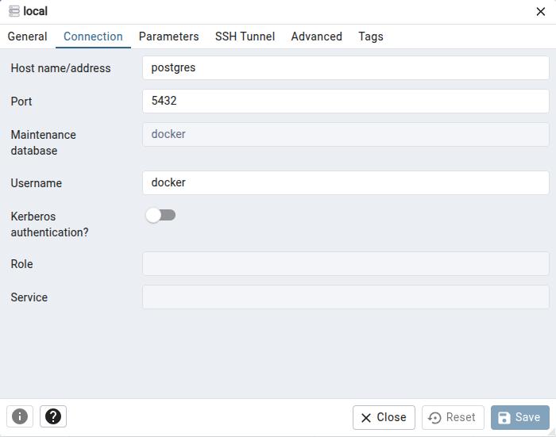

# SaaS RGPD API

<p>
    <a href="https://srv-gitlab.domaine.local/minds-labs/minds-rgpd/minds-rgpd-api#readme" target="_blank">
        
    </a>
    <a href="https://srv-gitlab/minds-labs/minds-rgpd/graphs/commit-activity" target="_blank">
        
    </a>
</p>

> SaaS RGPD API

## Accès rapides

### 🔗 Accès local

- 📘 [Documentation Swagger](http://localhost:8080/swagger-ui.html)
- 🚀 [Informations de déploiement](http://localhost:8080/actuator/info)
- 🧩 [Spécification OpenAPI (JSON)](http://localhost:8080/v3/api-docs)

### Intégration
- **URL de INT** :  https://int.minds-rgpd-api.minds.k8s/
- [swagger] (${int-env}/swagger-ui.html)
- [version_deployée] (${int-env}/actuator/info)
- [appel OpenApi] (${int-env}/v3/api-docs)

## Technologies

- `Java 21 :` Langage
- `Springboot 3 :` : Cadre de développement
- `Docker \ Kubernetes :` L'application est conteneurisée et déployée sur Kubernetes, les logs sont émis dans la console
  et les variables d'environnements sont utilisées pour paramétrer l'application
- `Flyway :` Gère le versionning de schéma de la BDD
- `Mockito :` Pour les Tests Unitaires
- `TestRestTemplate :` Pour les Tests d'Intégration
- `TestContainers :` Gestion automatique des bases de données de test
- `Springdoc :` Annotations permettant la génération d'un fichier de spécification de l'API au
  format [OpenApi](https://www.openapis.org).

## Liens utiles
- `Keycloack :` Gestion des droits applicatifs ([Keycloack](https://sso.minds.k8s/auth/realms/creative/account/applications))
- `Jira :` Backlog du projet ([Jira](https://jira-groupe-creative.atlassian.net/jira/software/projects/MSR/boards/427))
- `Jenkins A METTRE A JOUR :` CI/CD ([Jenkins](http://srv-jenkins2:8080/view/catalog/))

## Documentation initiale
- `Documentation : ` ([Contrat API](https://creativecorebusiness.sharepoint.com/:f:/s/CreativeAcademy-SaasRGPD/IgCKLA9_Af_nT78RkCmIHI4OAcek_wzV7BN27qgkaZBv2KQ?e=4XjnmU))
- `CDC : ` ([Cahier des Charges](https://creativecorebusiness.sharepoint.com/:f:/s/CreativeAcademy-SaasRGPD/IgCDpJ_O2sVVT44o2f4MIiR9AfanC6VXQz8hVTR_zHkTrWY?e=Uv4lkm))
- `PRT : ` ([Proposition technique](https://creativecorebusiness.sharepoint.com/:f:/s/CreativeAcademy-SaasRGPD/IgBYdnIqrMK7R4uzOI9nMAw6AYOgtqSrQiJ8EJWSUyNv8ak?e=yZ5EZg))
- `BDD : ` ([Gestion BDD avec IA](https://creativecorebusiness.sharepoint.com/:f:/s/CreativeAcademy-SaasRGPD/IgCy8U_skMNOSLnxMPfaZuVKAeNwQaywQznWB92M_yUoMgU?e=pH5unb))
- `Expression de besoin : ` ([Workflow et RG](https://creativecorebusiness.sharepoint.com/:o:/s/CreativeAcademy-SaasRGPD/IgBZzwkPcFMVS7asF8rILp4EASv9cDwimx4OOCMJ0rdRwbg?e=FuFglC))
- `UX/UI : ` ([Design UI](https://creativecorebusiness.sharepoint.com/:f:/s/CreativeAcademy-SaasRGPD/IgB0en5tzVHLTbipgPBMj1RgAdNF6yUsaVpLgr1lcpKPogc?e=pde2NO&xsdata=MDV8MDJ8fDEyYzdkNWQ5MzU2YjQ5NTY4ODhiMDhkZTg0MGJhYWQxfDA3Y2RmNmMyYjg2NjRmZmNhN2NmZWFlYjc1NTQ1Zjk1fDB8MHw2MzkwOTMzODI3Nzg1NTQ1MDd8VW5rbm93bnxWR1ZoYlhOVFpXTjFjbWwwZVZObGNuWnBZMlY4ZXlKRFFTSTZJbFJsWVcxelgwRlVVRk5sY25acFkyVmZVMUJQVEU5R0lpd2lWaUk2SWpBdU1DNHdNREF3SWl3aVVDSTZJbGRwYmpNeUlpd2lRVTRpT2lKUGRHaGxjaUlzSWxkVUlqb3hNWDA9fDF8TDJOb1lYUnpMekU1T2pnNVpUTmhOelV5TFdKbFlUSXROREEwT0MxaE56TmlMVGN5TTJRNE1ESTJZakExTjE4NVlqZ3hZVGhtWWkwelpUUTFMVFJqWW1ZdE9UWTJOeTAyT0RnMU5XRmpNMk0yTVROQWRXNXhMbWRpYkM1emNHRmpaWE12YldWemMyRm5aWE12TVRjM016YzBNVFEzTkRjeU5BPT18MTAxMzAwMTgxZDE5NGYzNDAzYjUwOGRlODQwYmFhZDF8OGU3NzllNWQwODllNDkwZmE0MWJlODY1NzY1MjJhZWU%3D&sdata=WWpiUlRqWDhoUmtSTndDZFJEYXdUZnRwY1I4OGRHQVlOMDR6bThLVHRIbz0%3D&ovuser=07cdf6c2-b866-4ffc-a7cf-eaeb75545f95%2Colivier.burban%40groupe-creative.fr))

## Prérequis

- Java 21
- Maven 3.6+
- Docker (pour TestContainers et Docker Compose auto-start)

## Getting started

### Paramétrer la BDD

Scripts à initialiser :

- `src/main/resources/db/migration/`
  - `V1.0__Script_de_creation.sql` : Initialise la base de données avec **Flyway** au démarrage de
    l'application, sur environnement ou pour utilisation locale.
  - `V2.0__Script_de_migration` : Modification de la table traitement

### Administrer la BDD

* En utilisant le **docker-compose.yml**, vous lancerez l'interface d'administration PgAdmin.
* Vous pouvez y accéder par votre navigateur à cette adresse http://localhost:8888.
* Connectez vous en utilisant l'adresse mail et le mot de passe présent dans `application-{env}.yaml`
* Cliquez sur `Add New Server`
* Remplissez les champs du formulaire.
  * Vous pouvez mettre le nom de votre choix dans l'onglet "General"
  * Pour l'onglet "Connection" :
  

### Paramétrer vos variables d'environnement

La liste des variables et leurs valeurs par défaut sont dans `docs/parametrage.md`

## Lancer les tests en Local

**Les tests utilisent maintenant TestContainers** - plus besoin de lancer Docker manuellement !

### Tests Unitaires et d'Intégration
- Depuis IDE 
  - Clic droit sur le répertoire `src/test/java`, puis `Run 'Tests in 'java''`
  - Si vous voulez lancer une classe de test en particulier, faites de même en cliquant sur la classe / le repertoire d'intérêt
- Depuis commande maven
  - Lancer `mvn test` (TestContainers démarre automatiquement PostgreSQL)
  - Lancer `mvn test -Dtest=PocLazyLoadingIT` pour les tests d'intégration spécifiques

**Note :** TestContainers gère automatiquement le cycle de vie des conteneurs de test.

### Configurer les droits applicatifs

Les droits applicatifs sont gérés par [Keycloack](https://sso.minds.k8s/auth/realms/creative/account/applications) :
l'API ne stocke plus les utilisateurs en base, elle interroge le realm Keycloak au travers d'une couche d'identité dédiée.

#### Architecture de la couche identité

- **Port** : `business/identity/IdentityGateway` — l'interface consommée par les services métier
  (utilisateurs, groupes, rôles disponibles, synchronisation à la création/suppression de client).
- **Adaptateur** : `infrastructure/keycloak/KeycloakIdentityGateway` — implémentation Keycloak appuyée sur
  `KeycloakAdminClient` (API d'administration REST, authentification `client_credentials`, pagination `first/max`).
- **Substitution de test** : `NoopIdentityGateway` (profil `test`) — les tests d'intégration tournent sans Keycloak.

#### Conventions Keycloak

| Élément | Convention |
| --- | --- |
| Realm | `minds-rgpd` (variable `KEYCLOAK_REALM`) |
| Client d'administration | `minds-rgpd-admin` (service account, `client_credentials`) |
| Client applicatif porteur des rôles | `minds-saas-rgpd` (rôles clients Keycloak) |
| Groupes clients | sous-groupes du parent `/clients` : `/clients/{nom du client}` (variable `KEYCLOAK_GROUP_PREFIX`) |
| Rôles applicatifs | rôles **clients** Keycloak `user` / `admin` / `superadmin`, exposés au frontend en `ROLE_USER` / `ROLE_ADMIN` / `ROLE_SUPERADMIN` |

> ⚠️ **Le back ne lit pas `realm_access`** : `JwtAuthConverter` ne mappe que
> `resource_access.minds-saas-rgpd.roles` (et `client_groups`). Un rôle de *realm*
> (même nommé `superadmin`) ne donnera jamais `ROLE_SUPERADMIN` côté API.
> Les droits doivent être des **rôles client** de `minds-saas-rgpd`, injectés dans
> le token via le client scope `minds-saas-rgpd` (mappers `client roles` et
> `group-membership`) — voir `docs/rapport-integration-front.md` §2.2.

Un utilisateur appartient à **au plus un** sous-groupe client : la modification d'un utilisateur retire
son ancien groupe client avant de l'affecter au nouveau, et remplace ses rôles clients.

#### Provisionnement initial du realm

La connexion d'administration suppose trois éléments créés une fois dans le realm `minds-rgpd` :

1. **Le client d'administration** `minds-rgpd-admin` (Clients → Create client) :
   - Client authentication **ON**, Service accounts **ON**, Standard flow et Direct access grants **OFF** ;
   - Credentials → copier le *Client secret* → variable d'environnement `KEYCLOAK_ADMIN_CLIENT_SECRET` de l'API ;
   - Service accounts → *Assign role* → filtrer sur `realm-management` → attribuer au minimum
     `view-users`, `manage-users`, `view-clients`, `view-groups`, `manage-groups`
     (ainsi que `query-users`, `query-groups`, `query-clients` si disponibles).
2. **Le client applicatif** `minds-saas-rgpd` : ses rôles clients — en minuscules, ex. `user`, `admin`, `superadmin` —
   constituent le vocabulaire exposé par `GET /utilisateurs/roles` et attendu dans les payloads ;
   le rôle `superadmin` est requis pour le CRUD clients/logos.
3. **Le groupe parent** `clients` à la racine du realm (Groups → Create group) : l'API crée les groupes
   clients dessous (`/clients/{nom}`) ; un utilisateur n'est rattaché à son client que si son groupe
   est sous ce préfixe.
Les rôles et groupes ne sont jamais inclus dans les réponses de l'API d'administration Keycloak : la passerelle
les reconstitue par requêtes inverses (rôles du client → utilisateurs par rôle, parent → sous-groupes → membres).

#### Synchronisation automatique avec les clients SaaS

- **Création** d'un client : le groupe `/clients/{nom}` est créé (un groupe préexistant est purgé puis recréé).
- **Renommage** : le groupe est synchronisé avec le nouveau nom.
- **Suppression** : les membres du groupe sont supprimés de Keycloak, puis le groupe lui-même.

#### Variables d'environnement

`KEYCLOAK_BASE_URL`, `KEYCLOAK_REALM`, `KEYCLOAK_ADMIN_CLIENT_ID`, `KEYCLOAK_ADMIN_CLIENT_SECRET`,
`KEYCLOAK_RESOURCE_CLIENT_ID`, `KEYCLOAK_GROUP_PREFIX` — valeurs par défaut dans `docs/parametrage.md`.

- **Hors Kubernetes** : `application.yaml` fournit des défauts (SSO `https://sso.minds.k8s/auth`, realm `minds-rgpd`) ;
  seul `KEYCLOAK_ADMIN_CLIENT_SECRET` n'a pas de défaut et doit être fourni.
- **Sur Kubernetes** (chart Helm `.platforms/k8s/helm`) : la configMap injecte `keycloak.base-url`,
  `keycloak.realm`, `keycloak.admin-client-id`, `keycloak.resource-client-id` et `keycloak.group-prefix`
  (values `back.keycloak.*`, prod sur `https://sso.groupe-creative.fr/auth`) ; un ExternalSecret dédié
  (`<nom>-keycloak`, isolé du secret DB) lit `KEYCLOAK_ADMIN_CLIENT_SECRET` dans Vault, propriété
  `keycloak_admin_client_secret` du chemin `back.secret.path` (une par environnement).
- **Sans variable du tout** : si `keycloak.enabled` est vrai mais que `KEYCLOAK_BASE_URL` ou
  `KEYCLOAK_ADMIN_CLIENT_SECRET` manque, l'application **refuse de démarrer** avec un message explicite
  (`KeycloakAdminClient`), au lieu de répondre 400 `Illegal character in path` sur chaque appel.

##### Déposer le secret Keycloak dans Vault

Le *Client secret* du compte de service `minds-rgpd-admin` est la seule valeur que l'API ne peut pas
déduire : elle doit être ajoutée dans Vault, **dans le secret déjà utilisé pour `dbpassword`**
(`back.secret.path`), sous la clé `keycloak_admin_client_secret`. Le secret de la base de données n'est
pas touché : la clé s'ajoute à côté.

| Environnement | Chemin Vault (`back.secret.path`) | SSO / realm | Valeur à recopier |
| --- | --- | --- | --- |
| int | `saas_rgpd/int/k8s` | `https://sso.minds.k8s/auth` — realm `minds-rgpd` | Client secret de `minds-rgpd-admin` |
| valid | `saas_rgpd/valid/k8s` | idem | idem |
| demo | `saas_rgpd/demo/k8s` | idem | idem |
| prod | `minds-rgpd/k8s/config` | `https://sso.groupe-creative.fr/auth` — realm `minds-rgpd` | Client secret du `minds-rgpd-admin` de prod |

Les environnements int, valid et demo pointent sur le **même** SSO et le même realm : la valeur est
identique pour les trois (seul le chemin Vault diffère). La prod est un autre Keycloak, donc une autre
valeur.

Interface Vault : *Secrets engines* → moteur KV → chemin de l'environnement → **Create new version**
→ *Add* → clé `keycloak_admin_client_secret` → coller le *Client secret* → *Save*.

En CLI, le *mount* KV est celui du `SecretStore` `vault-backend` (`vault secrets list` pour le retrouver) :

```bash
vault kv patch <mount>/saas_rgpd/int/k8s     keycloak_admin_client_secret='<secret>'
vault kv patch <mount>/saas_rgpd/valid/k8s   keycloak_admin_client_secret='<secret>'
vault kv patch <mount>/saas_rgpd/demo/k8s    keycloak_admin_client_secret='<secret>'
vault kv patch <mount>/minds-rgpd/k8s/config keycloak_admin_client_secret='<secret prod>'
```

`kv patch` conserve `dbpassword`. En KV v1 (pas de patch), réécrire toutes les clés avec `vault kv put`.

Vérification, après `helm upgrade` :

```bash
vault kv get <mount>/saas_rgpd/valid/k8s                     # dbpassword + keycloak_admin_client_secret
kubectl get externalsecret -n <namespace>                    # <back.name>-keycloak : SecretSynced=True
kubectl get secret <back.name>-keycloak -n <namespace> \
  -o jsonpath='{.data.KEYCLOAK_ADMIN_CLIENT_SECRET}' | base64 -d   # doit renvoyer le secret
```

Sans la clé dans Vault, le `Secret` `<back.name>-keycloak` n'existe pas : le pod reste en
`CreateContainerConfigError` (sur `KEYCLOAK_ADMIN_CLIENT_SECRET` uniquement — le secret de la base
n'est pas concerné). C'est le comportement voulu : une configuration Keycloak incomplète doit être
visible au déploiement, pas sous forme de 400 à l'usage.

#### Tests de la couche identité

Les tests unitaires `KeycloakAdminClientTest` (serveur HTTP simulé via `MockRestServiceServer`) et
`KeycloakIdentityGatewayTest` (client simulé via Mockito) valident jeton, pagination, relance après 401,
reconstitution des rôles/groupes et changements de groupe — aucun Keycloak réel n'est requis pour `mvn test`.

## Run the app locally

**Spring Boot démarre automatiquement les services Docker Compose** - plus besoin de `docker compose up` !

1. Compiler les sources si nécessaire
   ```shell
   mvn package
   ```
   2. Lancer l'application (démarre automatiquement PostgreSQL et PgAdmin)
      ```shell
      mvn spring-boot:run -Dspring-boot.run.profiles=dev
      ```

**Note :** Le profil `dev` est requis car il contient les valeurs de configuration correspondant au `docker-compose.yml`. Spring Boot détecte automatiquement le fichier `docker-compose.yml` et démarre les services nécessaires.