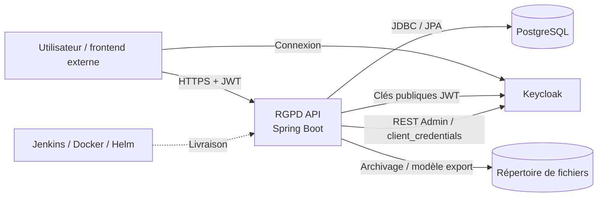
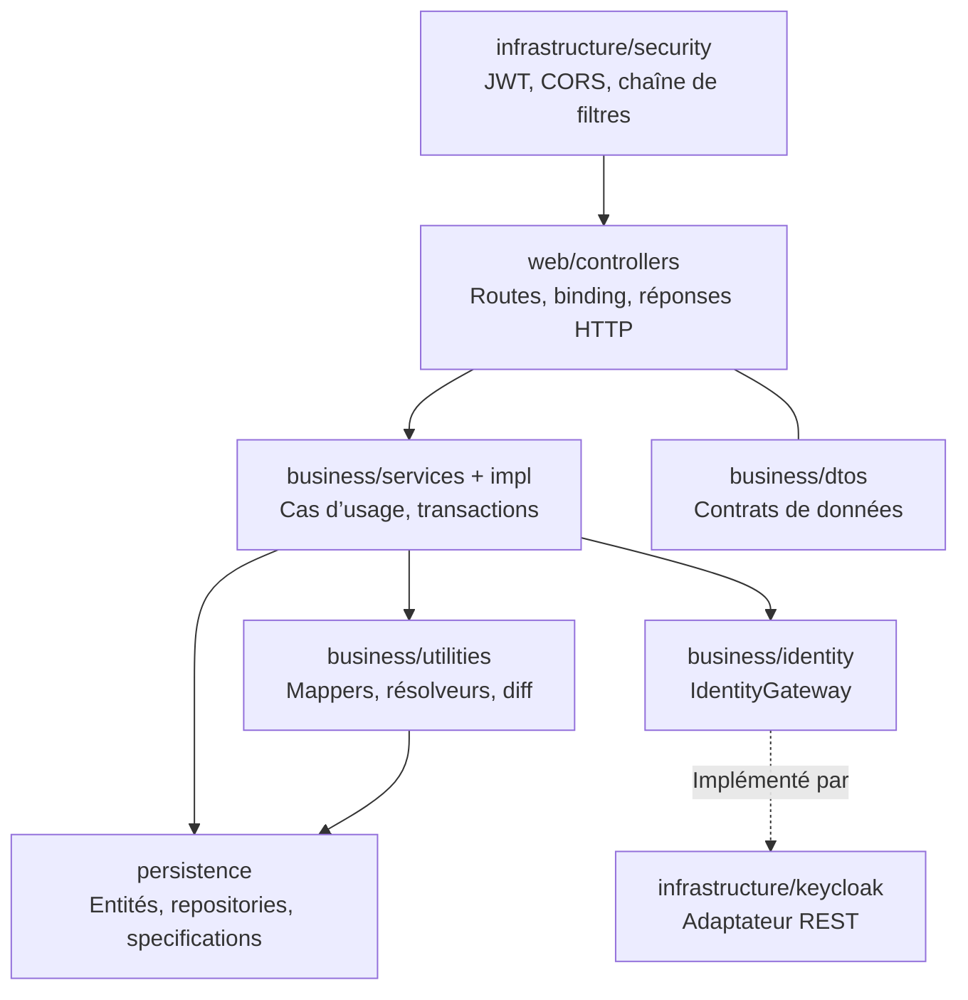
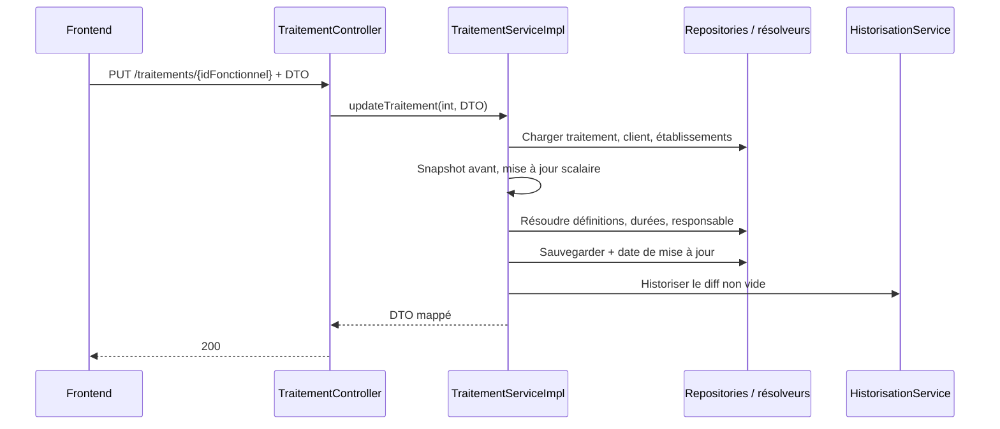

# Architecture du système

[Accueil](../index.md) / Prendre ses repères

## 1. Vue de contexte



Il n’y a pas de microservices métier séparés dans ce dépôt. L’API est un **monolithe modulaire en couches**, avec une abstraction de type port/adaptateur pour l’identité. Il serait inexact de qualifier l’ensemble d’architecture hexagonale stricte : les services métier importent directement les entités et repositories JPA.

| Frontière | Responsabilité | Propriété importante |
| --- | --- | --- |
| Frontend → API | REST, JWT, JSON / multipart | Pas de frontend compilé ici |
| API → PostgreSQL | Données métier et migrations | Transactions Spring, pas de stockage des comptes via `UtilisateurServiceImpl` |
| API → Keycloak | Validation JWT et gestion d’identités | Deux usages et deux configurations à distinguer |
| API → disque | Classeurs archivés / modèles d’export | Hors transaction SQL ; persistance à organiser |
| Plateforme → API | Configuration, image, probes | Dépend de ressources Kubernetes externes |

## 2. Vue des couches



### Contrôleurs

`web/controllers` contient dix contrôleurs. Ils bindent les paramètres, appliquent certaines contraintes de validation et des annotations de sécurité, puis délèguent aux services. La plupart renvoient `ResponseEntity`. Certains traitements spécifiques demeurent dans le contrôleur : copie du fichier importé sur disque, ETag du logo, choix du client du JWT.

### Services métier

Les interfaces de `business/services` décrivent les cas d’usage ; `impl` contient onze implémentations, y compris le service de logo séparé du service client. Les transactions de lecture sont souvent au niveau classe, les écritures annotées `@Transactional` au niveau méthode.

### DTO et mappers

Les DTO évitent d’exposer directement les graphes JPA. MapStruct génère les conversions. Les DTO partiels des listes de traitements, préconisations et violations réduisent le graphe exposé. `ClientWriteDTO` est volontairement limité aux champs scalaires ; `UtilisateurWriteDTO` est distinct de la réponse et contient éventuellement un mot de passe, à ne jamais journaliser.

### Référentiels et résolveurs

`DefinitionResolver`, `DureeResolver` et `ResponsableTraitementResolver` réutilisent ou créent les valeurs liées au client. À la modification d’un traitement, les références sont résolues sur une instance transitoire avant d’être copiées vers l’entité managée, pour éviter un flush avec des associations transitoires.

### Persistance et recherche

Les repositories Spring Data JPA exposent les recherches et écritures ; les `Specifications` construisent les filtres. `spring.jpa.open-in-view=false` implique que les associations nécessaires au mapping doivent être accessibles **dans** la transaction. Ne corrigez pas une erreur de lazy-loading en réactivant Open Session in View sans analyser la requête et le mapping.

### Identité

`IdentityGateway` est le port consommé par les services. `KeycloakIdentityGateway` reconstitue utilisateurs, groupes et rôles avec `KeycloakAdminClient`. Le remplacement de test est dans `src/test/java` et non dans le JAR livré. [Guide identité](05-securite.md).

## 3. Flux : modifier un traitement



Points de contrôle lors d’un changement : identifiant fonctionnel et UUID distincts, appartenance client, références déjà présentes, absence de cycles de mapping et tests du diff. Les opérations SQL et d’historisation participent aux transactions Spring quand appelées via les services.

## 4. Transactions et cohérence externe

| Opération | Cohérence disponible | Limite |
| --- | --- | --- |
| Écriture métier + historique JPA | Transactions SQL déclarées | Vérifier les exceptions et les appels internes |
| Import SQL | Transaction avec rollback explicite si une feuille obligatoire n’a aucune ligne importable | Cas d’erreurs capturées à examiner ; ne pas promettre un rollback universel |
| Écriture client + appels Keycloak | Transaction SQL + appels HTTP synchrones | Aucune transaction distribuée ; Keycloak ne se restaure pas avec le rollback SQL |
| Import SQL + copie du fichier | Deux étapes successives | Copie disque dans le contrôleur, après le retour du service |
| Modification utilisateur | Plusieurs appels REST | Une panne intermédiaire peut laisser rôles, groupe ou mot de passe partiellement modifiés |

**Recommandations, non implémentées :** formaliser une stratégie de compensation/réconciliation pour Keycloak ; rendre l’archivage de fichier indépendant et traçable ; préciser idempotence et concurrence des opérations destructives.

## 5. Organisation physique du dépôt

```text
pom.xml                      Build mono-module, dépendances et profil IntegrationTests
src/main/java/com/minds/rgpd/ Code compilé
  RgpdApplication.java       Point d’entrée Spring Boot
  web/controllers/           Interface HTTP
  business/                  DTO, services, import, identité et utilitaires
  persistence/               Entités, repositories et Specifications
  infrastructure/            Sécurité et Keycloak
src/main/resources/          application*.yaml et migrations Flyway
src/test/                    Tests, configuration et classeur de fixture
.platforms/ci/               Build, analyses, packaging
.platforms/k8s/              Scripts, valeurs et chart Helm
Jenkinsfile                  Orchestration CI/CD
business/ et infrastructure/ Copies à la racine, hors source Maven standard
docs/                        Documentation et archives de conception
```

!!! warning "Deux emplacements ressemblants"
    Les répertoires `business/identity` et `infrastructure/keycloak` à la racine contiennent des copies de classes également présentes sous `src/main/java`. Le POM ne les ajoute pas comme racines source. Modifiez les sources compilées sous `src/main/java` ; ne supposez pas que les copies restent synchronisées. Leur nettoyage fait l’objet d’un point de vigilance, pas d’une modification dans ce travail documentaire.

## 6. Dépendances structurantes

| Dépendance | Version déclarée / repère | Usage |
| --- | --- | --- |
| Spring Boot | 4.0.5 | Web, sécurité, JPA, validation, Actuator, Flyway |
| Java | 21 | Compilation et runtime |
| Springdoc | 3.0.3 | OpenAPI et Swagger UI |
| MapStruct | 1.6.3 | Mapping généré |
| Lombok | propriété 1.18.38 | Réduction du code déclaratif, annotation processor |
| Apache POI | 5.4.0 | Lecture / écriture Excel |
| Testcontainers PostgreSQL | 1.21.4 | Base PostgreSQL de tests |
| JaCoCo | 0.8.13 | Instrumentation et rapport de couverture |
| Tomcat | propriété 11.0.21 | Version surchargée dans le POM |

Les versions non explicitement fixées doivent être lues dans le POM effectif Maven, pas devinées. Aucun cache distribué, bus de messages ou ordonnanceur métier n’est décrit dans les sources analysées.

**Suite :** [Modèle de données](../reference/donnees.md) · [API](04-api.md).
