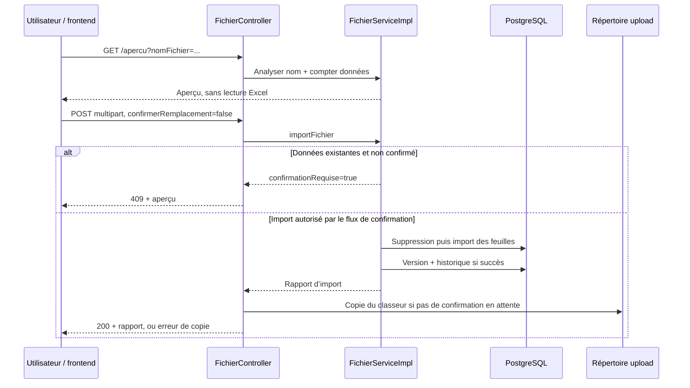

# Importer et exporter les registres Excel

[Accueil](../index.md) / Développer

## Avant de commencer

!!! danger "Remplacement, pas fusion"
    L’import supprime les traitements, préconisations et violations existants du client ciblé avant réinsertion. Même si les feuilles facultatives ne sont pas présentes dans le nouveau classeur, les anciennes données correspondantes sont supprimées. Utiliser des données jetables ou une sauvegarde restaurable validée.

**Composants :** `FichierController` → `FichierServiceImpl` → `ExcelImportService` + `ImportSpecifications` → services/référentiels/repositories.

## 1. Convention de nommage

```text
<client>_<etablissement>_Registre RGPD_ed<version>.xlsx
<client>_<etablissement>_Registre RGPD_ed<version>.xls
```

Exemple fictif : `Organisation Test_CREATIVE_Registre RGPD_ed1.0.xlsx`.

Le nom est validé par une expression régulière insensible à la casse. Les deux premiers segments ne doivent pas contenir `_`. Le **premier segment** recherche un client déjà présent en base ; la version est extraite après `ed`. Le segment établissement du nom ne suffit pas à créer ou autoriser un rattachement métier.

**Attention sécurité :** le client de l’import vient du nom du fichier ; le contrôleur n’effectue pas de comparaison avec le client unique du jeton. Le nom de fichier n’est pas une preuve d’autorisation.

## 2. Consulter l’aperçu

`GET /importFichierRgpd/apercu?nomFichier=...` ne lit pas le contenu du classeur et ne modifie pas les données. Il analyse le nom et compte les objets existants.

Le `ImportApercuDTO` expose notamment : validité du nom, nom client, versions actuelle/fichier, date actuelle, indicateur de remplacement, nombres de traitements/préconisations/violations, avertissement et URL d’export préalable.

**Un aperçu valide n’est donc pas une validation des feuilles, colonnes ou lignes du classeur.**

```bash
curl --fail-with-body --get -H "Authorization: Bearer $TOKEN" \
  --data-urlencode 'nomFichier=Organisation Test_CREATIVE_Registre RGPD_ed1.0.xlsx' \
  "$API/importFichierRgpd/apercu"
```

## 3. Envoyer, puis confirmer si nécessaire



Premier envoi sans confirmation (à adapter à un fichier de test) :

```bash
curl --fail-with-body -H "Authorization: Bearer $TOKEN" \
  -F 'file=@/chemin/Organisation Test_CREATIVE_Registre RGPD_ed1.0.xlsx' \
  -F 'confirmerRemplacement=false' "$API/importFichierRgpd"
```

En cas de `409` avec `confirmationRequise=true`, afficher l’avertissement et attendre une décision explicite. Un second envoi avec `confirmerRemplacement=true` permet le remplacement ; ne pas automatiser cette confirmation sur un registre réel.

## 4. Lire le classeur

| Feuille | Traitement |
| --- | --- |
| `Registre de traitement` | Feuille principale ; en-têtes ligne 6, premières données ligne 7 |
| `Suivi des préconisations` ou `Préconisations` | Facultative, si l’un de ces noms est trouvé |
| `Recueil de violation`, `Recueil de violations`, `Registre des violations` | Facultative, peut être vide |

Le registre exporté commence ses colonnes métier en **B**. Les libellés sont contractuels ; ne les « corrigez » pas sans modifier et tester le mapping d’import. Certains libellés sont répétés (scores, sécurité physique/numérique) ; le parseur conserve plusieurs indices de colonne par libellé.

`ExcelImportService` :

1. sélectionne la feuille et lit les en-têtes à la ligne définie par la spécification ;
2. vérifie la présence des colonnes requises ;
3. ignore les lignes absentes/vides et celles dont tous les champs requis sont vides ;
4. relève les erreurs de valeurs obligatoires par numéro de ligne Excel (base 1) ;
5. applique le mapper de la spécification ;
6. capture les `ExcelParsingException` attendues comme erreurs de ligne ; les autres exceptions remontent.

Les règles exactes de colonnes, conversion et persistance sont dans [ImportSpecifications](../../src/main/java/com/minds/rgpd/business/Imports/ImportSpecifications.java) et [ExcelRow](../../src/main/java/com/minds/rgpd/business/Imports/ExcelRow.java). Le fixture de test permet de comprendre le format, mais ne doit pas être envoyé à un environnement partagé sans contrôle de ses données.

## 5. Interpréter le résultat et le rollback

Le rapport `InfoFichierDTO` contient le nom, la date de réception, `statusFichier` et les informations de confirmation/aperçu. **HTTP 200 seul ne prouve pas la réussite métier.** Lire le rapport, les messages de feuilles et vérifier le registre après import.

Le service déclare une transaction. Le rollback explicite du rapport ne se déclenche que lorsqu’une feuille non autorisée à être vide n’a aucune ligne importable. **Des lignes valides sont conservées même si d’autres lignes sont en erreur** ; le rapport final peut alors rester `statusFichier="OK"`. Une réussite ne garantit donc pas l’import de toutes les lignes. Vérifier les comptages et les logs de feuilles. Il gère également certaines exceptions (`IOException`, `IllegalArgumentException`) en retournant un statut d’échec. Ne pas en déduire que tous les cas d’échec capturés annulent automatiquement des suppressions antérieures : les branches d’erreur doivent être testées explicitement.

La copie du fichier est effectuée dans le contrôleur **après** le service et seulement conditionnée à l’absence de confirmation en attente, pas à un indicateur strict de succès métier. Il est donc possible d’archiver un fichier dont le rapport indique un échec. À l’inverse, une copie disque échouée peut produire un `500` après des changements SQL déjà validés.

## 6. Exporter

`GET /importFichierRgpd/export` choisit le client unique du JWT, puis construit :

```text
<client>_CREATIVE_Registre RGPD_ed<version>.xlsx
```

La version par défaut de l’export est `1.0` si elle est absente. Le service recherche dans le répertoire d’upload un classeur portant ce nom pour l’utiliser comme modèle. Sinon il génère un classeur. Il réécrit les données du registre avec des en-têtes compatibles avec l’import.

- Dates Excel exportées : `jj/MM/aaaa`.
- Booléens métier : `Oui` / `Non` ; critères d’impact : `X` ou vide.
- Établissements : noms séparés par des sauts de ligne.
- Réponse : MIME XLSX, `Content-Disposition: attachment` ; ce header est explicitement exposé par cette route.

!!! warning "L’export n’est pas une sauvegarde exhaustive"
    Les données du registre sont réécrites ; des feuilles d’un modèle archivé peuvent être conservées sans être recalculées depuis la base. Préconisations, violations, historiques, identités et état global de PostgreSQL ne sont pas garantis restaurables par cet export. Définir une vraie stratégie de sauvegarde séparée.

## 7. Stockage et contrôles à prévoir

Le répertoire est `application.fichier.upload.dir`. Le contrôleur résout le nom reçu sous ce chemin et copie avec `REPLACE_EXISTING`. **Recommandations :** normalisation stricte du chemin et vérification qu’il reste sous la racine, nom interne généré, contrôle des tailles, politique de conservation, chiffrement/permissions, antivirus selon la politique de l’entreprise et suivi des échecs d’archivage.

Le chart présente une intention de volume mais pas un montage actif garantissant la persistance des classeurs. Ne pas compter sur le filesystem éphémère du pod pour conserver les modèles. Voir [exploitation](08-exploitation.md).

## Checklist QA

- [ ] Nom invalide, client inconnu, version changée.
- [ ] Fichier vide, mauvais format, feuille principale absente, colonne obligatoire absente.
- [ ] Lignes vides/formules, dates invalides, doublons, feuille facultative vide.
- [ ] Import sans confirmation : aucun remplacement et aucune archive.
- [ ] Import confirmé : périmètre exact des suppressions vérifié.
- [ ] Erreur après suppression : vérifier le rollback réel.
- [ ] Échec de copie disque : comparer état SQL, rapport et fichier.
- [ ] Export → réimport sur base isolée : colonnes, références et numéros conservés selon le contrat.
- [ ] Utilisateur du client A avec un nom de fichier ciblant B : test d’autorisation négatif.
