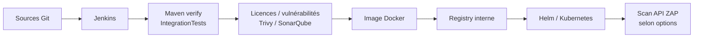

# CI/CD, déploiement et exploitation

[Accueil](../index.md) / Exploiter

## Vue de livraison



Le pipeline dépend d’un environnement d’entreprise : Jenkins, GitLab interne, registre Nexus, SonarQube, accès Kubernetes, Vault/External Secrets et éventuellement Jaeger. Les adresses présentes dans les fichiers sont des **valeurs du dépôt**, pas des services dont la disponibilité a été vérifiée pendant la revue.

## Jenkins et scripts

[Source : Jenkinsfile](../../Jenkinsfile).

| Étape déclarée | Script / mécanisme | À comprendre |
| --- | --- | --- |
| Préparation | bootstrap, calcul de version Git | Variables de build et fichiers temporaires |
| Build | `.platforms/ci/build.sh` | Conteneur Maven 3.9.5 / JDK21, socket Docker monté pour les tests |
| Licences | `check-licenses.sh` | Analyse des licences selon les paramètres du script |
| Vulnérabilités | `check-vulnerability.sh` | Dépendances, exclusions dans `project-suppression-cve.xml` |
| Trivy | `trivy.sh` | Analyse conditionnelle selon paramètres |
| SonarQube | `sonar.sh` | Paramètres de branche et criticité |
| Package | `package.sh` | Docker build/tag ; push avec `--with-push` |
| Deploy | `.platforms/k8s/deploy.sh` | Helm upgrade/install |
| ZAP | `security-scan.sh`, `zap.sh` | Scan dynamique d’API après déploiement selon options |

La présence d’une étape ne prouve pas qu’elle s’exécute sur toutes les branches ni que son résultat bloque systématiquement la livraison. Lire les conditions et consulter les rapports du build concerné. Le [guide ZAP existant](../../.platforms/ci/ZAP-securityScan-README.md) donne le contexte spécifique.

Ne pas lancer les scripts CI au hasard sur un poste : certains sourcent `.env`, requièrent des variables Jenkins, montent le socket Docker ou exécutent un `chown` avec l’utilisateur Jenkins. Le socket Docker donne un accès sensible à l’hôte CI et doit rester contrôlé.

## Construction de l’image

Le Dockerfile `.platforms/ci/dockerfiles/dockerfile` **ne compile pas les sources** : il copie un JAR déjà produit dans `target/*.jar`. Son stage nommé `builder` utilise une image Maven interne ; le runtime est `eclipse-temurin:21.0.11_10-jre-alpine-3.23`.

- Port exposé : 8080.
- JAR runtime : `/app/minds-rgpd-api.jar`.
- Utilisateur non root : `app-usr`, groupe `app-grp`.
- Répertoires créés : `/app/tmp`, `/app/data`.
- Démarrage : `java ... -jar /app/minds-rgpd-api.jar`.

Préparer un seul artefact cible approprié et vérifier son contenu/version avant packaging. Le `.yaml` de développement est exclu du JAR ; injecter la configuration de l’environnement.

## Ressources Kubernetes

| Ressource du chart | Fonction |
| --- | --- |
| Deployment | Image, variables, ressources, probes |
| Service ClusterIP | Exposition interne sur 8080 par défaut |
| Ingress + Middleware Traefik | TLS, chemin `/apims`, retrait du préfixe |
| ConfigMap | URL JDBC, nom DB, origines, JWT, Keycloak, chemin d’upload |
| ExternalSecret | Intention de récupération du mot de passe DB et du secret Keycloak depuis Vault |

Prérequis externes non provisionnés ici : namespace, base PostgreSQL, accès registry, contrôleur Ingress Traefik et CRD Middleware, cert-manager avec `ca-issuer`, External Secrets et `SecretStore` `vault-backend`, données Vault, stockage persistant si nécessaire.

### Valeurs et environnements

Les fichiers de surcharge sont `.platforms/k8s/values-int.yaml`, `values-valid.yaml`, `values-demo.yaml`, `values-prod.yaml`. Le script `deploy.sh` accepte seulement **int / valid / demo** ; l’existence d’un fichier prod n’implique pas un parcours production fonctionnel.

Le script cible le namespace `minds`, construit un nom de release avec projet et environnement, puis utilise `helm upgrade --install --debug --wait`. Vérifier le contexte Kubernetes avant toute commande opérante.

### Probes et ressources par défaut

Valeurs communes du chart : 1 replica, demandes 256Mi / 250m CPU, limites 768Mi / 500m CPU, healthcheck `/actuator/health`. Liveness : délai initial 60s ; readiness : 100s ; période 10s et seuil d’échecs 3 pour les deux.

Ces valeurs sont des defaults, **pas un dimensionnement validé**. L’import Excel et les exports en mémoire doivent être mesurés sur des tailles représentatives. Quand tracing est activé, une startupProbe exécute un `curl` vers Jaeger : valider la présence de l’outil et éviter de confondre disponibilité applicative et disponibilité du collecteur.

## État des manifests : validation obligatoire

!!! danger "Ne pas présenter ce chart comme prêt pour production"
    `deployment.yaml` contient `ecretKeyRef` à la place de `secretKeyRef` et des délimiteurs Helm espacés `{ { ... } }`. Dans `secret.yaml`, le second ExternalSecret est imbriqué au lieu d’être un document YAML distinct. Ces anomalies statiques empêchent de considérer le branchement du secret Keycloak comme valide.

Les montages de volume sont commentés ; une valeur `volume.claimName` ne monte pas un PVC. La persistance des classeurs reste à implémenter/valider.

Validation **sans déployer** (sur un poste avec Helm et accès à des valeurs expurgées) :

```bash
helm lint .platforms/k8s/helm -f .platforms/k8s/values-int.yaml
helm template rgpd-api-int .platforms/k8s/helm \
  -f .platforms/k8s/values-int.yaml > /tmp/rgpd-rendered.yaml
```

Corriger les anomalies avant déploiement ; relire le rendu et ses références de secrets. Ne pas publier un rendu contenant des données sensibles. Cette revue documentaire n’exécute pas de déploiement et ne corrige pas les manifests applicatifs.

## Runbook : vérifier un environnement

1. Confirmer contexte, namespace, release et version attendus avec l’équipe.
2. Vérifier l’état du Deployment, des pods, des probes et les événements Kubernetes.
3. Lire les logs de démarrage : configuration résolue, DB, migrations, erreurs de beans.
4. Tester la santé via le chemin effectif Ingress.
5. Vérifier un appel authentifié **en lecture** avec un compte synthétique et un client dédié.
6. Vérifier séparément les appels d’administration Keycloak autorisés ; ne pas créer/supprimer un client réel pour tester le SSO.
7. Surveiller mémoire, latence, erreurs 5xx, espace disque, connexion DB et SSO.

Commandes de lecture indicatives, après substitution des placeholders :

```bash
kubectl --context <contexte> -n <namespace> get pods
kubectl --context <contexte> -n <namespace> describe deployment <deployment>
kubectl --context <contexte> -n <namespace> logs deployment/<deployment> --tail=100
helm --kube-context <contexte> -n <namespace> history <release>
```

Ne pas copier de logs contenant des données personnelles dans des canaux non autorisés.

## Sauvegarde et restauration

**À définir avec l’exploitation, pas fourni comme automatisation dans ce dépôt :**

- sauvegarde PostgreSQL, conservation et restauration testée ;
- sauvegarde/continuité Keycloak selon la plateforme IAM ;
- stockage et sauvegarde des classeurs archivés ;
- chiffrement, droits et politique de suppression des fichiers ;
- RPO/RTO, responsables et procédure d’incident.

Un rollback Helm ne restaure ni les données migrées par Flyway, ni les suppressions Keycloak, ni les classeurs écrasés. Avant une livraison avec migration destructive : sauvegarde vérifiée, compatibilité descendante et procédure de reprise approuvées.

## Traces et diagnostic

Logs console : point de départ réel. Actuator : disponible mais trop ouvert par défaut. Les variables OTEL du chart décrivent une intention de tracing ; vérifier les dépendances/exporteurs et le comportement effectif. Ne pas annoncer un tracing distribué opérationnel sur la seule base de ces variables.

**Suite :** [Diagnostic et vigilance](09-vigilance.md).
