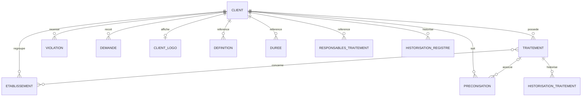

# Modèle de données et migrations

[Accueil](../index.md) / Références

> Référence extraite des sources par `tools/generate_docs_reference.py`. À relire après chaque évolution ; le code et le contrat runtime priment.

## Vue métier simplifiée

Ce schéma montre les associations structurantes, pas toutes les colonnes ni toutes les contraintes SQL. Les migrations et annotations JPA détaillées restent la référence ; plusieurs anciennes classes/structures coexistent avec les référentiels actuels.

### Clés, ownership et relations

- `Client` : UUID ; version et date de version du registre ; référentiels rattachés.
- `Traitement` : UUID technique `identifiant` et numéro entier `idFonctionnel`. Les routes ne les utilisent pas de façon uniforme.
- `Etablissement` : UUID, nom unique par client (`uq_etablissement_nom_client`), département et booléen principal.
- `ClientLogo` : relation un-à-un avec identifiant partagé via `@MapsId` ; contenu en base, MIME, ETag, nom et taille. L’ETag est le SHA-256 du contenu.
- `Definition` : type et valeur, référencée notamment par finalité, sensibilité, étude d’impact et licéité du traitement.
- `Duree` : valeur, indicateur archivage et client ; unicité client / archivage / valeur.
- `ResponsableTraitement` : valeur et informations complémentaires ; unicité client / valeur. Malgré un ancien commentaire SQL « 1-1 », le modèle permet plusieurs valeurs par client.
- Historiques : événements avec date, motif et auteur ; auteur issu du contexte utilisateur, repli « système » en l’absence d’utilisateur exploitable.
- Utilisateurs : le service courant utilise Keycloak via `IdentityGateway`. La présence de structures historiques ne signifie pas qu’elles pilotent l’administration des comptes.

### Suppressions et cascades

Ne pas assimiler une cascade JPA à une suppression réglementaire complète. Les migrations définissent aussi des actions SQL (`CASCADE`, `SET NULL`) sur certaines clés étrangères. La suppression d’un traitement peut emporter son historique lié ; un événement au niveau registre est alors écrit par le service de suppression individuelle. L’import supprime aussi préconisations et violations du client. Les actions Keycloak et disque sont hors des garanties transactionnelles SQL.

### Historisation : portée réelle

Le service de traitement historise création, différences de modification et suppression au niveau approprié ; le service d’import historise le registre. Des routes permettent l’ajout manuel d’événements avec auteur déterminé côté serveur. Le motif de modification vient de `TraitementDiff`. Cela ne démontre pas un journal d’audit immuable, inviolable ou couvrant toutes les entités : durcissement, conservation et accès doivent être définis séparément.

## Inventaire des types de persistance

Le tableau inclut les classes du package, **y compris celles sans `@Entity`**, pour éviter de confondre type Java et table réelle. Les entités héritées peuvent partager une table ; vérifier les annotations d’héritage.

| Type Java | Mapping déclaré | Source |
| --- | --- | --- |
| `Client` | `CLIENT` | [Client.java](../../src/main/java/com/minds/rgpd/persistence/entities/Client.java) |
| `ClientLogo` | `client_logo` | [ClientLogo.java](../../src/main/java/com/minds/rgpd/persistence/entities/ClientLogo.java) |
| `CurrentUser` | Pas de @Entity déclaré | [CurrentUser.java](../../src/main/java/com/minds/rgpd/persistence/entities/CurrentUser.java) |
| `Definition` | `definition` | [Definition.java](../../src/main/java/com/minds/rgpd/persistence/entities/Definition.java) |
| `Demande` | `demande` | [Demande.java](../../src/main/java/com/minds/rgpd/persistence/entities/Demande.java) |
| `Duree` | `duree` | [Duree.java](../../src/main/java/com/minds/rgpd/persistence/entities/Duree.java) |
| `Etablissement` | `ETABLISSEMENT` | [Etablissement.java](../../src/main/java/com/minds/rgpd/persistence/entities/Etablissement.java) |
| `EtudeImpact` | `@Entity`, sans @Table explicite | [EtudeImpact.java](../../src/main/java/com/minds/rgpd/persistence/entities/EtudeImpact.java) |
| `FinalitePrincipale` | `@Entity`, sans @Table explicite | [FinalitePrincipale.java](../../src/main/java/com/minds/rgpd/persistence/entities/FinalitePrincipale.java) |
| `HistorisationGenerique` | Pas de @Entity déclaré | [HistorisationGenerique.java](../../src/main/java/com/minds/rgpd/persistence/entities/HistorisationGenerique.java) |
| `HistorisationRegistre` | `historisation_Registre` | [HistorisationRegistre.java](../../src/main/java/com/minds/rgpd/persistence/entities/HistorisationRegistre.java) |
| `HistorisationTraitement` | `historisation_Traitement` | [HistorisationTraitement.java](../../src/main/java/com/minds/rgpd/persistence/entities/HistorisationTraitement.java) |
| `LiceiteTraitement` | `@Entity`, sans @Table explicite | [LiceiteTraitement.java](../../src/main/java/com/minds/rgpd/persistence/entities/LiceiteTraitement.java) |
| `Preconisation` | `preconisation` | [Preconisation.java](../../src/main/java/com/minds/rgpd/persistence/entities/Preconisation.java) |
| `Profil` | `PROFIL` | [Profil.java](../../src/main/java/com/minds/rgpd/persistence/entities/Profil.java) |
| `ResponsableTraitement` | `responsables_traitement` | [ResponsableTraitement.java](../../src/main/java/com/minds/rgpd/persistence/entities/ResponsableTraitement.java) |
| `Sensibilite` | `@Entity`, sans @Table explicite | [Sensibilite.java](../../src/main/java/com/minds/rgpd/persistence/entities/Sensibilite.java) |
| `Traitement` | `traitement` | [Traitement.java](../../src/main/java/com/minds/rgpd/persistence/entities/Traitement.java) |
| `Violation` | `violation` | [Violation.java](../../src/main/java/com/minds/rgpd/persistence/entities/Violation.java) |

## Historique Flyway

Ordre numérique des migrations présentes. Il n’y a pas de V10 dans ce dépôt ; les versions Flyway n’ont pas à être contiguës. Une table de suivi `flyway_schema_history` est gérée par Flyway au runtime. Aucun état de migration d’une base distante n’a été vérifié.

| Version | Objet annoncé par le fichier | Source SQL |
| --- | --- | --- |
| `V1.0` | Script de creation | [V1.0__Script_de_creation.sql](../../src/main/resources/db/migration/V1.0__Script_de_creation.sql) |
| `V2.0` | Script de migration | [V2.0__Script_de_migration.sql](../../src/main/resources/db/migration/V2.0__Script_de_migration.sql) |
| `V3.0` | Modifications type colonnes traitement | [V3.0__Modifications_type_colonnes_traitement.sql](../../src/main/resources/db/migration/V3.0__Modifications_type_colonnes_traitement.sql) |
| `V4.0` | Modifications table traitement | [V4.0__Modifications_table_traitement.sql](../../src/main/resources/db/migration/V4.0__Modifications_table_traitement.sql) |
| `V5.0` | Suppression colonne gestionnaire | [V5.0__Suppression_colonne_gestionnaire.sql](../../src/main/resources/db/migration/V5.0__Suppression_colonne_gestionnaire.sql) |
| `V6.0` | Ajout colonne donnees concernees | [V6.0__Ajout_colonne_donnees_concernees.sql](../../src/main/resources/db/migration/V6.0__Ajout_colonne_donnees_concernees.sql) |
| `V7.0` | Evolution Modele de donnees | [V7.0__Evolution_Modele_de_donnees.sql](../../src/main/resources/db/migration/V7.0__Evolution_Modele_de_donnees.sql) |
| `V8.0` | Create demande | [V8.0__Create_demande.sql](../../src/main/resources/db/migration/V8.0__Create_demande.sql) |
| `V9.0` | Creation table preconisation | [V9.0__Creation_table_preconisation.sql](../../src/main/resources/db/migration/V9.0__Creation_table_preconisation.sql) |
| `V11.0` | Creation table violation | [V11.0__Creation_table_violation.sql](../../src/main/resources/db/migration/V11.0__Creation_table_violation.sql) |
| `V12.0` | Registre colonnes complementaires et historisation | [V12.0__Registre_colonnes_complementaires_et_historisation.sql](../../src/main/resources/db/migration/V12.0__Registre_colonnes_complementaires_et_historisation.sql) |
| `V13.0` | Creation table client logo | [V13.0__Creation_table_client_logo.sql](../../src/main/resources/db/migration/V13.0__Creation_table_client_logo.sql) |
| `V14.0` | Ajout colonnes etablissement | [V14.0__Ajout_colonnes_etablissement.sql](../../src/main/resources/db/migration/V14.0__Ajout_colonnes_etablissement.sql) |

## Lire une évolution de schéma

1. Lire toutes les migrations dans l’ordre, pas seulement V1.
2. Comparer le SQL final aux entités courantes et aux DTO.
3. Vérifier les contraintes et les chemins de suppression avant un import ou un delete.
4. Tester depuis une base vide et depuis une base de la version précédente.
5. Ne jamais réécrire une migration déjà partagée pour « arranger » un checksum.

Les schémas draw.io historiques sont référencés dans [Entretien de la documentation](../guides/10-documentation.md). Pour faire évoluer le modèle, suivre le [guide de développement](../guides/07-developpement.md).
